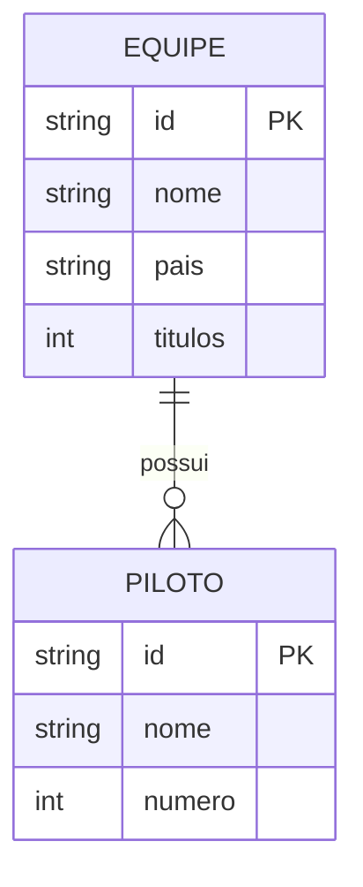

```mermaid
erDiagram
    EQUIPE ||--o{ PILOTO : possui

    EQUIPE {
        string id PK
        string nome
        string pais
        int titulos
    }

    PILOTO {
        string id PK
        string nome
        int numero
    }
```
